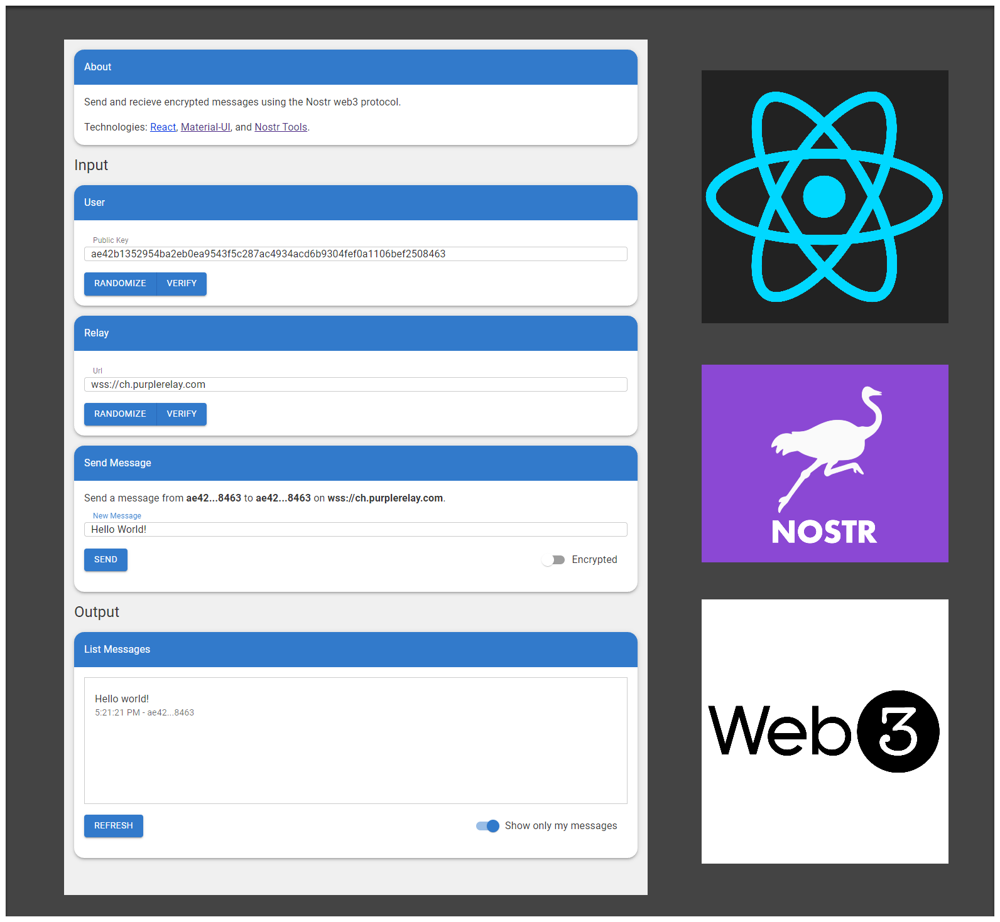

# The React Nostr App

This app combines [Nostr](https://nostr.com/), [React](https://react.dev/), [TypeScript](https://www.typescriptlang.org/), and [Vite](https://vitejs.dev/).

 

<figure>
  
</figure>
 

# Getting Started

### Play Project

1. Browse to app at [SamuelAsherRivello.github.io/react-nostr-blocks-game](https://samuelasherrivello.github.io/react-nostr-blocks-game/index.html)
1. Browse to docs at [SamuelAsherRivello.github.io/react-nostr-blocks-game/documentation/](https://samuelasherrivello.github.io/react-nostr-blocks-game/documentation/index.html)
1. Enjoy!

 

# Overview

This app combines [Nostr](https://nostr.com/), [React](https://react.dev/), [TypeScript](https://www.typescriptlang.org/), and [Vite](https://vitejs.dev/).

### Nostr

Nostr is a simple, open protocol that enables global, decentralized, and censorship-resistant social media.

| Platform                                 | Protocol  | Algorithm | Decentralized | User Owns Data | User Account Portable | Moderation | Popularity |
| ---------------------------------------- | --------- | --------- | ------------- | -------------- | --------------------- | ---------- | ---------- |
| [**Nostr**](https://nostr.com)           | 🟢 Open   | 🟢 Open   | ✅            | 🟢 High        | 🟢 Global             | 🔴 Low     | 🔴 Low     |
| [**Twitter**](https://twitter.com)       | 🔴 Closed | 🔴 Closed | ❌            | 🔴 Low         | 🔴 Per Product        | 🟢 High    | 🟢 High    |
| [**Mastodon**](https://joinmastodon.org) | 🟢 Open   | 🟢 Open   | ✅            | 🟢 High        | 🟡 Per Server         | 🟠 Med     | 🟠 Med     |
| [**Bluesky**](https://blueskyweb.xyz)    | 🟢 Open   | 🟢 Open   | ✅            | 🟢 High        | 🟡 Per Server         | 🟠 Med     | 🟠 Med     |

 

# Credits

**Created By**

- Samuel Asher Rivello
- Over 25 years XP with game development (2024)
- Over 11 years XP with Unity (2024)

**Contact**

- Twitter - <a href="https://twitter.com/srivello/">@srivello</a>
- Git - <a href="https://github.com/SamuelAsherRivello/">Github.com/SamuelAsherRivello</a>
- Resume & Portfolio - <a href="http://www.SamuelAsherRivello.com">SamuelAsherRivello.com</a>
- LinkedIn - <a href="https://Linkedin.com/in/SamuelAsherRivello">Linkedin.com/in/SamuelAsherRivello</a> <--- Say Hello! :)

**License**

Provided as-is under MIT License | Copyright © 2024 Rivello Multimedia Consulting, LLC
